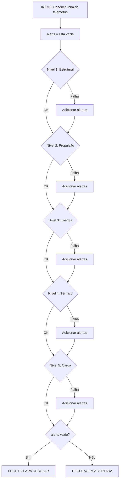
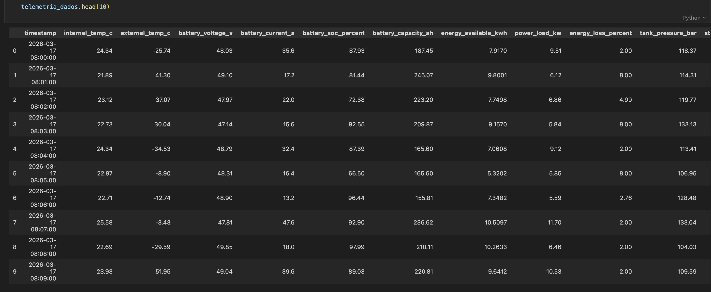
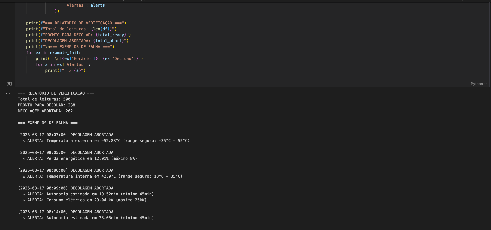
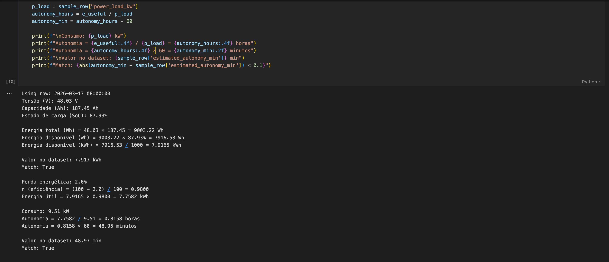
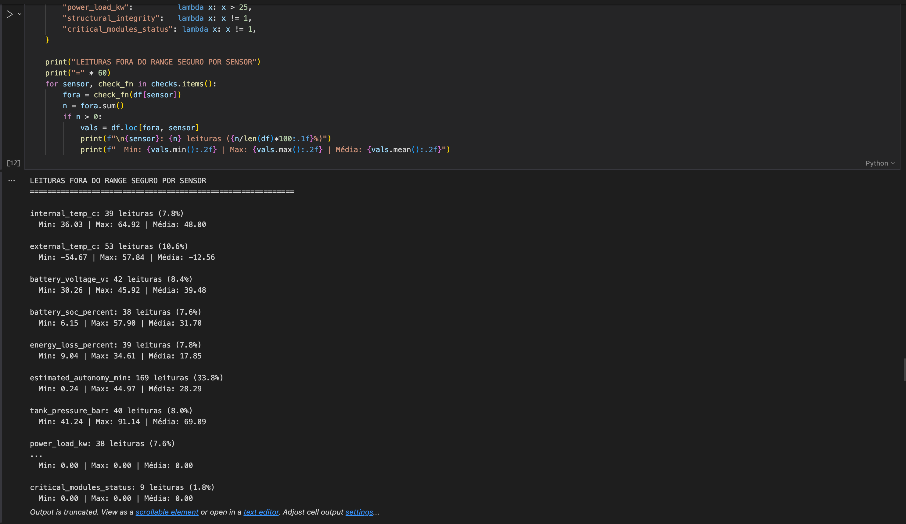

# 🚀 Missão Aurora Siger — Relatório Operacional de Pré-Decolagem

## Sobre o Projeto

Atividade Integradora da Fase 1 do curso de Ciência da Computação — FIAP.

O projeto simula a verificação de telemetria de uma espaçonave antes do 
lançamento, utilizando dados derivados de um dataset real de consumo 
energético (UCI Household Power Consumption) transformados para o contexto 
aeroespacial.

**Aluno:** João Mariano da Silveira Peçanha  
**RM:** 573434  

## Estrutura do Repositório
```
├── as-integrativa.ipynb    # Notebook principal com toda a análise
├── telemetry_aurora.csv    # Dataset de telemetria gerado
├── flowchart.png           # Fluxograma do algoritmo de verificação
├── screenshots/            # Prints da execução
│   ├── telemetria.png
│   ├── verificacao.png
│   ├── energia.png
│   └── anomalias.png
└── README.md
```

## Como Executar

1. Clone o repositório:
```bash
   git clone https://github.com/[seu-usuario]/aurora-siger-fase01.git
```
2. Instale as dependências:
```bash
   pip install pandas numpy matplotlib
```
3. Abra o notebook:
```bash
   jupyter notebook as-integrativa.ipynb
```
4. Execute todas as células em ordem (Kernel → Restart & Run All)

> **Nota:** O dataset original (household_power_consumption.txt) tem ~130MB 
> e não está incluído no repositório. O notebook utiliza o dataset já 
> processado (telemetry_aurora.csv) para execução rápida.

## Seções do Projeto

| Seção | Descrição |
|-------|-----------|
| 5.1 | Organização e descrição da telemetria |
| 5.2 | Algoritmo de verificação (pseudocódigo + fluxograma) |
| 5.3 | Script Python com função `verificar_lancamento()` |
| 5.4 | Análise energética (cadeia: E_disponível → η → E_útil → autonomia) |
| 5.5 | Análise assistida por IA (Claude Opus 4.6) |
| 5.6 | Reflexão crítica (ética, impacto social, sustentabilidade) |

## Fluxograma do Algoritmo


## Screenshots da Execução

### Telemetria gerada


### Relatório de verificação


### Análise energética


### Análise de anomalias


## Tecnologias Utilizadas

- Python 3.14
- Pandas / NumPy
- Jupyter Notebook
- Claude AI (Opus 4.6) — análise assistida