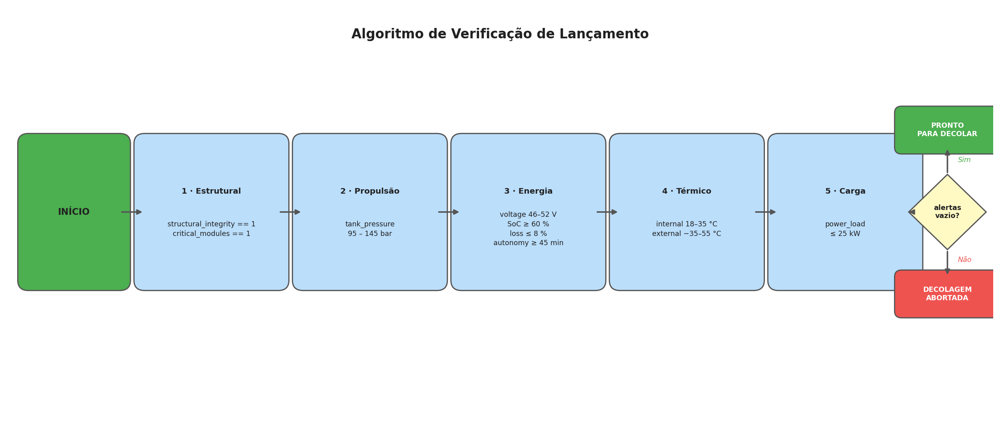

# 🚀 Missão Aurora Siger — Relatório Operacional de Pré-Decolagem

## Sobre o Projeto

Atividade Integradora da Fase 1 do curso de Ciência da Computação — FIAP.

O projeto simula a verificação de telemetria de uma espaçonave antes do lançamento, utilizando dados derivados de um dataset real de consumo energético ([UCI Household Power Consumption](https://archive.ics.uci.edu/dataset/235/individual+household+electric+power+consumption)) transformados para o contexto aeroespacial.

**Aluno:** João Mariano da Silveira Peçanha
**RM:** 573434

## Estrutura do Repositório

```
├── as-integrativa.ipynb    # Notebook principal com toda a análise
├── telemetry_aurora.csv    # Dataset de telemetria gerado
├── flowchart.png           # Fluxograma do algoritmo de verificação
├── screenshots/            # Prints da execução
│   ├── telemetria.png
│   ├── verificacao.png
│   ├── energia.png
│   └── anomalias.png
└── README.md
```

## Como Executar

1. Clone o repositório:
   ```bash
   git clone https://github.com/JmCoding1304/aurora-siger-fase01.git
   ```
2. Instale as dependências:
   ```bash
   pip install pandas numpy matplotlib
   ```
3. Abra o notebook:
   ```bash
   jupyter notebook as-integrativa.ipynb
   ```
4. Execute todas as células em ordem (Kernel → Restart & Run All)

> **Nota:** O dataset original (`household_power_consumption.txt`) tem ~130MB e não está incluído no repositório. O notebook utiliza o dataset já processado (`telemetry_aurora.csv`) para execução rápida.

## Seções do Projeto

| Seção | Descrição |
|-------|-----------|
| 5.1 | Organização e descrição da telemetria |
| 5.2 | Algoritmo de verificação (pseudocódigo + fluxograma) |
| 5.3 | Script Python com função `verificar_lancamento()` |
| 5.4 | Análise energética (cadeia: E_disponível → η → E_útil → autonomia) |
| 5.5 | Análise assistida por IA (Claude Opus 4.6) |
| 5.6 | Reflexão crítica (ética, impacto social, sustentabilidade) |

## Fluxograma do Algoritmo



O algoritmo verifica 5 níveis de subsistemas em sequência — **Estrutural → Propulsão → Energia → Térmico → Carga** — acumulando alertas ao longo do percurso. Se ao final não houver alertas, a espaçonave está **pronta para decolar**; caso contrário, a **decolagem é abortada**.

## Screenshots da Execução

### Telemetria gerada


### Relatório de verificação


### Análise energética


### Análise de anomalias


## Tecnologias Utilizadas

- Python 3.14
- Pandas / NumPy
- Jupyter Notebook
- Claude AI (Opus 4.6) — análise assistida
